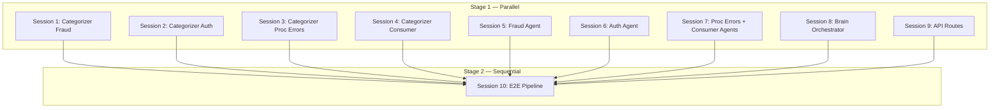

# Testing Implementation Spec — LLM Evaluation Suite

## Overview

This document specifies the full testing implementation plan for the **Visa Disputes Agent LLM Evaluation Suite**. The suite validates that every LLM-powered component — categorization, agent reasoning, orchestration, API integration, and end-to-end pipelines — produces correct, rule-compliant outputs against the Visa Core Rules.

The work is divided across **10 Devin sessions** in **2 stages**:

| Stage | Sessions | Parallelism | Purpose |
|-------|----------|-------------|---------|
| **Stage 1** | Sessions 1–9 | All 9 run **in parallel** | Unit / integration evals for each module |
| **Stage 2** | Session 10 | Runs **after** Stage 1 completes | End-to-end pipeline evals |

All test files live under `tests/evals/` and share fixtures from `tests/evals/fixtures/`.

---

## Stage 1 — Parallel Sessions (Sessions 1–9)

### Session 1: Categorizer Evals — Fraud (Category 10)

**File:** `tests/evals/test_categorizer_fraud.py`

Validates that `categorize_dispute()` correctly identifies Category 10 (Fraud) disputes and their specific condition codes.

| # | Test Name | Input Scenario | Expected Output |
|---|-----------|---------------|-----------------|
| 1 | `test_emv_counterfeit_fraud_chip_card` | Card-present, chip card, non-chip-initiated, fraud type `4` (counterfeit) | Category `10`, Condition `10.1`, confidence ≥ 0.85 |
| 2 | `test_emv_counterfeit_fraud_chip_initiated_still_categorized` | Card-present, chip card, chip-initiated, fraud type `4` | Category `10`, Condition `10.1` (categorizer assigns; agent rejects later) |
| 3 | `test_emv_non_counterfeit_lost_card` | Chip card, fraud type `0` (lost) | Category `10`, Condition `10.2` |
| 4 | `test_emv_non_counterfeit_stolen_card` | Chip card, fraud type `1` (stolen) | Category `10`, Condition `10.2` |
| 5 | `test_other_fraud_card_present` | Card-present environment, fraud type present, no chip | Category `10`, Condition `10.3` |
| 6 | `test_other_fraud_card_absent_ecommerce` | E-commerce environment, fraud type present | Category `10`, Condition `10.4` |
| 7 | `test_other_fraud_card_absent_moto` | MOTO environment, fraud type present | Category `10`, Condition `10.4` |
| 8 | `test_fraud_from_statement_unauthorized_card_present` | Statement says "unauthorized", card-present, no fraud type | Category `10`, Condition `10.3` |
| 9 | `test_fraud_from_statement_unauthorized_card_absent` | Statement says "unauthorized", e-commerce, no fraud type | Category `10`, Condition `10.4` |
| 10 | `test_fraud_from_statement_identity_theft` | Statement says "identity theft", e-commerce | Category `10`, Condition `10.4` |

---

### Session 2: Categorizer Evals — Authorization (Category 11)

**File:** `tests/evals/test_categorizer_authorization.py`

Validates that `categorize_dispute()` correctly identifies Category 11 (Authorization) disputes.

| # | Test Name | Input Scenario | Expected Output |
|---|-----------|---------------|-----------------|
| 1 | `test_card_recovery_bulletin` | Statement mentions "card recovery bulletin" | Category `11`, Condition `11.1` |
| 2 | `test_declined_authorization_response_code` | Auth response code non-zero (not starting with `0`) | Category `11`, Condition `11.2` |
| 3 | `test_declined_authorization_from_statement` | Statement says "declined", auth response non-zero | Category `11`, Condition `11.2` |
| 4 | `test_no_authorization_no_auth_code` | No authorization code, statement says "no authorization" | Category `11`, Condition `11.3` |
| 5 | `test_no_authorization_missing_code_non_recurring` | No auth code, non-recurring, no consumer keywords in statement | Category `11`, Condition `11.3` |
| 6 | `test_expired_card_declined` | Statement says "expired card", auth code absent | Category `11`, Condition `11.3` |

---

### Session 3: Categorizer Evals — Processing Errors (Category 12)

**File:** `tests/evals/test_categorizer_processing_errors.py`

Validates that `categorize_dispute()` correctly identifies Category 12 (Processing Errors) disputes.

| # | Test Name | Input Scenario | Expected Output |
|---|-----------|---------------|-----------------|
| 1 | `test_duplicate_processing` | Statement says "duplicate" | Category `12`, Condition `12.6` |
| 2 | `test_charged_twice` | Statement says "charged twice" | Category `12`, Condition `12.6` |
| 3 | `test_paid_by_other_means` | Statement says "paid by other means" | Category `12`, Condition `12.6` |
| 4 | `test_incorrect_amount` | Statement says "incorrect amount" | Category `12`, Condition `12.5` |
| 5 | `test_wrong_amount` | Statement says "wrong amount" | Category `12`, Condition `12.5` |
| 6 | `test_incorrect_currency` | Statement says "incorrect currency" | Category `12`, Condition `12.3` |
| 7 | `test_wrong_account_number` | Statement says "wrong account" | Category `12`, Condition `12.4` |
| 8 | `test_incorrect_transaction_code` | Statement says "incorrect code" | Category `12`, Condition `12.2` |
| 9 | `test_invalid_data` | Statement says "invalid data" | Category `12`, Condition `12.7` |

---

### Session 4: Categorizer Evals — Consumer Disputes (Category 13)

**File:** `tests/evals/test_categorizer_consumer.py`

Validates that `categorize_dispute()` correctly identifies Category 13 (Consumer Disputes).

| # | Test Name | Input Scenario | Expected Output |
|---|-----------|---------------|-----------------|
| 1 | `test_merchandise_not_received` | Statement says "not received" | Category `13`, Condition `13.1` |
| 2 | `test_never_received` | Statement says "never received" | Category `13`, Condition `13.1` |
| 3 | `test_cancelled_recurring` | Is recurring, statement says "cancel" | Category `13`, Condition `13.2` |
| 4 | `test_not_as_described` | Statement says "not as described" | Category `13`, Condition `13.3` |
| 5 | `test_defective_merchandise` | Statement says "defective" | Category `13`, Condition `13.3` |
| 6 | `test_counterfeit_merchandise` | Statement says "counterfeit" (no fraud type) | Category `13`, Condition `13.4` |
| 7 | `test_misrepresentation` | Statement says "misrepresent" | Category `13`, Condition `13.5` |
| 8 | `test_credit_not_processed` | Statement says "credit not" | Category `13`, Condition `13.6` |
| 9 | `test_cancelled_merchandise` | Statement says "cancel" (non-recurring) | Category `13`, Condition `13.7` |
| 10 | `test_oct_not_accepted` | Statement says "original credit" | Category `13`, Condition `13.8` |
| 11 | `test_non_receipt_cash_atm` | ATM environment | Category `13`, Condition `13.9` |

---

### Session 5: Fraud Agent Evals (Category 10)

**File:** `tests/evals/test_agent_fraud.py`

Validates that `FraudDisputeAgent.process()` produces correct decisions, rule citations, and escalation behavior.

| # | Test Name | Input Scenario | Expected Output |
|---|-----------|---------------|-----------------|
| 1 | `test_valid_fraud_dispute_issuer_win` | Condition `10.4`, fraud type present, certification, amount < $25k | Resolution `issuer_win`, confidence ≥ 0.85, no human review |
| 2 | `test_fraud_invalid_chip_initiated_10_1` | Condition `10.1`, chip-initiated = True | Resolution `invalid_dispute`, `is_valid=False` |
| 3 | `test_fraud_time_expired` | Dispute filed > 120 days after transaction | Resolution `invalid_dispute`, rationale mentions time limit |
| 4 | `test_fraud_missing_documentation_human_review` | No fraud type code, no certification | `requires_human_review=True`, confidence < 0.70 |
| 5 | `test_fraud_high_value_human_review` | Amount > $25,000, all docs present | `requires_human_review=True`, reason mentions threshold |
| 6 | `test_fraud_rule_citations_present` | Valid fraud case | `rule_evaluations` is non-empty, each has `rule_section` |
| 7 | `test_fraud_stage_transitions` | Valid fraud case | Stage progresses: `RULE_EVALUATION` → `DECISION` → `RESOLVED` |
| 8 | `test_fraud_assigned_agent_set` | Any fraud case | `case.assigned_agent == "fraud_agent"` |

---

### Session 6: Authorization Agent Evals (Category 11)

**File:** `tests/evals/test_agent_authorization.py`

Validates that `AuthorizationDisputeAgent.process()` produces correct decisions.

| # | Test Name | Input Scenario | Expected Output |
|---|-----------|---------------|-----------------|
| 1 | `test_crb_with_evidence_issuer_win` | Condition `11.1`, CRB evidence provided | Resolution `issuer_win` |
| 2 | `test_crb_no_evidence_acquirer_win` | Condition `11.1`, no CRB evidence | Resolution `acquirer_win` |
| 3 | `test_declined_auth_valid` | Condition `11.2`, auth response non-zero/non-approved | Resolution `issuer_win` |
| 4 | `test_declined_auth_actually_approved` | Condition `11.2`, auth response starts with `0` (approved) | Resolution `invalid_dispute` |
| 5 | `test_no_auth_code_valid` | Condition `11.3`, auth code absent | Resolution `issuer_win` |
| 6 | `test_no_auth_but_code_exists` | Condition `11.3`, auth code present | Resolution `invalid_dispute` |
| 7 | `test_auth_time_expired` | Dispute filed > 120 days | Resolution `invalid_dispute` |
| 8 | `test_auth_stage_transitions` | Valid auth case | Stage progresses through `RULE_EVALUATION` → `DECISION` → `RESOLVED` |

---

### Session 7: Processing Errors & Consumer Agent Evals (Categories 12 & 13)

**File:** `tests/evals/test_agent_processing_consumer.py`

Validates that `ProcessingErrorsAgent` and `ConsumerDisputesAgent` produce correct decisions.

| # | Test Name | Input Scenario | Expected Output |
|---|-----------|---------------|-----------------|
| 1 | `test_processing_error_valid` | Condition `12.6` (duplicate), valid case | Resolution `issuer_win`, confidence ≥ 0.85 |
| 2 | `test_processing_error_12_5_no_amount` | Condition `12.5`, no dispute amount | Resolution `invalid_dispute` |
| 3 | `test_processing_error_time_expired` | Dispute filed outside time limit | Resolution `invalid_dispute` |
| 4 | `test_consumer_valid_merchandise_not_received` | Condition `13.1`, valid case | Resolution `issuer_win` |
| 5 | `test_consumer_cancelled_recurring_valid` | Condition `13.2`, recurring cancelled | Resolution `issuer_win` |
| 6 | `test_consumer_not_as_described_with_evidence` | Condition `13.3`, compelling evidence | Resolution `issuer_win` |
| 7 | `test_consumer_time_expired` | Consumer dispute filed outside time limit | Resolution `invalid_dispute` |
| 8 | `test_consumer_high_value_human_review` | Amount > $25,000 | `requires_human_review=True` |

---

### Session 8: DisputeBrain Orchestrator Evals

**File:** `tests/evals/test_brain_orchestrator.py`

Validates that `DisputeBrain` correctly orchestrates the full dispute lifecycle.

| # | Test Name | Input Scenario | Expected Output |
|---|-----------|---------------|-----------------|
| 1 | `test_brain_submit_and_process_fraud` | Submit fraud case via `process_single()` | Case reaches `RESOLVED`, has category + condition + decision |
| 2 | `test_brain_submit_and_process_consumer` | Submit consumer case via `process_single()` | Case reaches `RESOLVED`, correct category `13` |
| 3 | `test_brain_validation_rejects_missing_txn_id` | Case with empty `transaction_id` | Case reaches `REJECTED` stage |
| 4 | `test_brain_validation_rejects_zero_amount` | Case with amount ≤ 0 | Case reaches `REJECTED` stage |
| 5 | `test_brain_validation_rejects_missing_cardholder` | Case with empty `cardholder_name` | Case reaches `REJECTED` stage |
| 6 | `test_brain_agent_routing_fraud` | Fraud category case | `assigned_agent` == `fraud_agent` |
| 7 | `test_brain_agent_routing_authorization` | Auth category case | `assigned_agent` == `authorization_agent` |
| 8 | `test_brain_agent_routing_processing_errors` | Processing errors case | `assigned_agent` == `processing_errors_agent` |
| 9 | `test_brain_agent_routing_consumer` | Consumer case | `assigned_agent` == `consumer_disputes_agent` |
| 10 | `test_brain_get_case_summary` | Process a case, then call `get_case_summary()` | Returns dict with all expected keys |
| 11 | `test_brain_escalate_pre_arbitration` | Resolved case escalated to pre-arb | Stage becomes `PRE_ARBITRATION` or subsequent |
| 12 | `test_brain_escalate_arbitration` | Pre-arb case escalated to arbitration | Stage becomes `ARBITRATION` or `HUMAN_REVIEW` |
| 13 | `test_brain_human_review_approve` | Case in `HUMAN_REVIEW`, approve | Stage becomes `RESOLVED` |
| 14 | `test_brain_human_review_reject` | Case in `HUMAN_REVIEW`, reject | Stage becomes `PROCESSING`, decision cleared |
| 15 | `test_brain_stage_history_recorded` | Process a case | `stage_history` is non-empty, contains expected transitions |

---

### Session 9: API Routes Evals

**File:** `tests/evals/test_api_routes.py`

Validates that the FastAPI endpoints correctly handle requests and return proper responses.

| # | Test Name | Input Scenario | Expected Output |
|---|-----------|---------------|-----------------|
| 1 | `test_health_check` | `GET /health` | Status 200, `status == "healthy"` |
| 2 | `test_submit_dispute_fraud` | `POST /disputes` with fraud case | Status 200, response contains `case_id`, `stage`, `category` |
| 3 | `test_submit_dispute_consumer` | `POST /disputes` with consumer case | Status 200, category `13` |
| 4 | `test_list_disputes` | `GET /disputes` after submitting cases | Status 200, returns list of summaries |
| 5 | `test_get_dispute_detail` | `GET /disputes/{case_id}` | Status 200, response contains full detail fields |
| 6 | `test_get_dispute_not_found` | `GET /disputes/nonexistent-id` | Status 404 |
| 7 | `test_human_review_approve` | `POST /disputes/{id}/review` with `approved=True` | Status 200, stage transitions to `RESOLVED` |
| 8 | `test_human_review_not_found` | `POST /disputes/bad-id/review` | Status 404 |
| 9 | `test_escalate_pre_arbitration` | `POST /disputes/{id}/pre-arbitration` with acquirer evidence | Status 200, stage transitions |
| 10 | `test_escalate_arbitration` | `POST /disputes/{id}/arbitration` | Status 200, stage transitions |
| 11 | `test_add_evidence` | `POST /disputes/{id}/evidence` | Status 200, evidence count increases |
| 12 | `test_queue_stats` | `GET /queue/stats` | Status 200, response contains `queue_depth` and `stats` |

---

## Stage 2 — Sequential Session (Session 10)

### Session 10: End-to-End Pipeline Evals

**File:** `tests/evals/test_e2e_pipeline.py`

Runs after all Stage 1 sessions complete. Validates full dispute lifecycles spanning categorization → agent processing → orchestration → API, including multi-step flows like pre-arbitration and arbitration escalation.

| # | Test Name | Input Scenario | Expected Output |
|---|-----------|---------------|-----------------|
| 1 | `test_e2e_fraud_full_lifecycle` | Submit fraud dispute via API → process → resolve | Final stage `RESOLVED`, resolution `issuer_win`, all fields populated |
| 2 | `test_e2e_consumer_not_received_lifecycle` | Submit consumer 13.1 case via API → resolve | Correct category, condition, decision, rule citations |
| 3 | `test_e2e_auth_declined_lifecycle` | Submit auth 11.2 case via API → resolve | Correct routing to auth agent, valid decision |
| 4 | `test_e2e_processing_error_duplicate` | Submit processing 12.6 case via API → resolve | Correct routing and resolution |
| 5 | `test_e2e_fraud_to_pre_arbitration` | Submit fraud → resolve → escalate pre-arb with acquirer evidence | Pre-arb stage reached, new evaluation performed |
| 6 | `test_e2e_pre_arbitration_to_arbitration` | Fraud → resolve → pre-arb → arbitration | Arbitration stage reached, `arbitration_filed=True` |
| 7 | `test_e2e_human_review_flow` | Submit low-confidence case → human review → approve | Stage: `HUMAN_REVIEW` → `RESOLVED` after approval |
| 8 | `test_e2e_human_review_reject_reprocess` | Submit case → human review → reject → reprocess | Stage returns to `PROCESSING` then re-resolves |
| 9 | `test_e2e_invalid_dispute_rejected` | Submit case with missing data (no txn ID) | Stage reaches `REJECTED`, no agent assigned |
| 10 | `test_e2e_high_value_fraud_requires_review` | Submit $50,000 fraud case | Goes to `HUMAN_REVIEW` due to high value |
| 11 | `test_e2e_add_evidence_mid_flow` | Submit case → add evidence → verify evidence attached | Evidence list grows, evidence fields correct |
| 12 | `test_e2e_multiple_disputes_independent` | Submit 3 different disputes | Each gets independent case_id, category, resolution |

---

## Dependency Graph



---

## File Structure

```
tests/
├── __init__.py                              # existing
├── conftest.py                              # existing — shared mock framework (autouse)
├── evals/
│   ├── __init__.py                          # package init
│   ├── fixtures/
│   │   └── __init__.py                      # shared eval fixtures (case builders, etc.)
│   ├── test_categorizer_fraud.py            # Session 1
│   ├── test_categorizer_authorization.py    # Session 2
│   ├── test_categorizer_processing_errors.py# Session 3
│   ├── test_categorizer_consumer.py         # Session 4
│   ├── test_agent_fraud.py                  # Session 5
│   ├── test_agent_authorization.py          # Session 6
│   ├── test_agent_processing_consumer.py    # Session 7
│   ├── test_brain_orchestrator.py           # Session 8
│   ├── test_api_routes.py                   # Session 9
│   └── test_e2e_pipeline.py                 # Session 10
```

---

## Conventions

### Naming
- Test files: `test_<component>_<scope>.py`
- Test functions: `test_<what>_<scenario>` (e.g., `test_fraud_high_value_human_review`)
- Classes (when used): `TestCategorizer<Category>`, `Test<Agent>Agent`, `TestBrain<Feature>`

### Fixtures & Mocks
- All eval tests inherit the autouse `_mock_openai_chat` and `_mock_visa_rules_loading` fixtures from `tests/conftest.py` — **no real OpenAI API calls are made**
- Shared case-builder helpers should be placed in `tests/evals/fixtures/__init__.py`
- Each test file may define local fixtures using `@pytest.fixture` for session-specific setup

### Assertions
- Use `assert case.category == DisputeCategory.FRAUD` (enum comparison, not string)
- Use `assert case.condition == DisputeCondition.EMV_COUNTERFEIT_FRAUD` (enum comparison)
- Confidence checks: `assert result.confidence >= 0.85` (float threshold)
- Stage checks: `assert case.stage == DisputeLifecycleStage.RESOLVED`
- Resolution checks: `assert case.decision.resolution == DisputeResolution.ISSUER_WIN`

### Running the Evals

```bash
# Run all evals
python -m pytest tests/evals/ -v

# Run a single session's tests
python -m pytest tests/evals/test_categorizer_fraud.py -v

# Run Stage 1 only (all except E2E)
python -m pytest tests/evals/ -v --ignore=tests/evals/test_e2e_pipeline.py

# Run Stage 2 only (E2E)
python -m pytest tests/evals/test_e2e_pipeline.py -v

# Run with coverage
python -m pytest tests/evals/ -v --cov=src --cov-report=term-missing
```

### Async
- All agent and brain tests must be `async def` — pytest-asyncio is configured with `asyncio_mode = "auto"` in `pyproject.toml`
- Categorizer tests are synchronous (`categorize_dispute()` is a sync function)
- API tests use `httpx.AsyncClient` with the FastAPI `TestClient` or `ASGITransport`

### CI Integration
- All eval tests are included in the default `python -m pytest tests/ -v` run
- Lint: `ruff check src/ tests/`
- No additional dependencies required beyond `[dev]` extras
